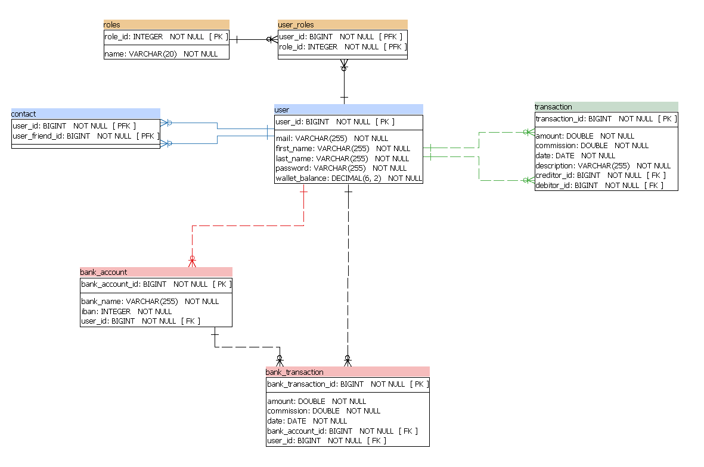
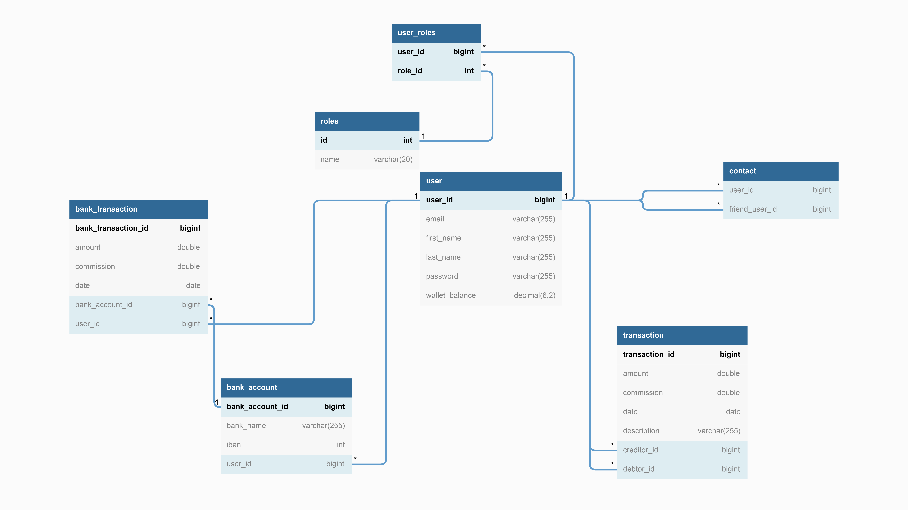

____________________

# PayMyBuddy Application
> -- _We make moving your money easy !_ --

## Prerequisites

### Ensure you have this installed before use:

- Java 14.0.1
- Maven 3.8.4
- Node v16.14.2
- npm 8.5.0
- Angular-cli 9.1.3
- MySQL, Connector/J & Community Server

## Build
Build application with the command `mvn clean install` for the back-end side and then with the command `npm run install` for the frond-end side.

## Login to application

You can run the

### Super user
You can use user with username '_admin@paymybuddy.com_' and password
'_admin123_' to connect as a super user with 'ADMIN' authorizations.

## Technology Stack
Component         | Technology
---               | ---
Frontend          | [Angular 9](https://github.com/angular/angular)
Backend (REST)    | [SpringBoot 2.5.6](https://projects.spring.io/spring-boot) (Java)
Database          | [MySQL](https://www.mysql.com/)
Security          | Spring Security & [JSON Web Token](https://jwt.io/)
Persistence       | JPA (Using Spring Data)
Client Build Tools| [angular-cli](https://github.com/angular/angular-cli) npm
Server Build Tools| Maven(Java)

## Documentation

### SQL Scripts
Contains the principal database and the database for the tests.
https://github.com/simoncourtecuisse/PayMyBuddy/tree/master/src/main/resources/MySQL

### Model Database (SQL)

### UML Diagram

### Other Resources
See [HELP.md](https://github.com/simoncourtecuisse/PayMyBuddy/blob/main/PayMyBuddy/HELP.md) for helpful documentation regarding Spring Boot and [README.md](/README.md) for important commands and documentation relating to Angular and its embedded server.