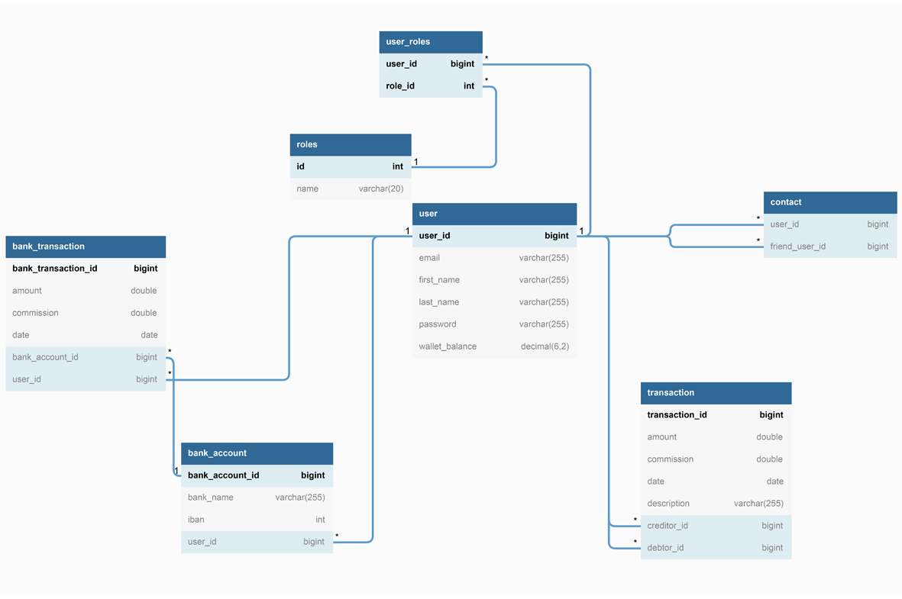

# PayMyBuddy Application 
## - We make moving your money easy! -

### Build
Build application with the command `mvn clean install` for the back-end side and then with the command `npm run install` for the frond-end side.

### Login to application
##### Super user
You can use user with username '_admin@paymybuddy.com_' and password
'_admin123_' to connect as a super user with 'ADMIN' authorizations.

### Documentation

##### Technology Stack
Component         | Technology
---               | ---
Frontend          | [Angular 9](https://github.com/angular/angular)
Backend (REST)    | [SpringBoot 2.5.6](https://projects.spring.io/spring-boot) (Java 11)
Database          | [MySQL](https://www.mysql.com/)
Security          | Spring Security & [JSON Web Token](https://jwt.io/)
Persistence       | JPA (Using Spring Data)
Client Build Tools| [angular-cli](https://github.com/angular/angular-cli) npm
Server Build Tools| Maven(Java)

Java 11
Angular 9

##### SQL Scripts
Contains the principal database and the database for the tests.
https://github.com/simoncourtecuisse/PayMyBuddy/tree/master/src/main/resources/MySQL

##### Model Database (SQL)

##### UML Diagram

